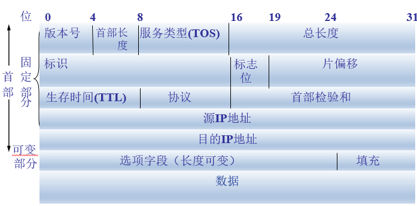
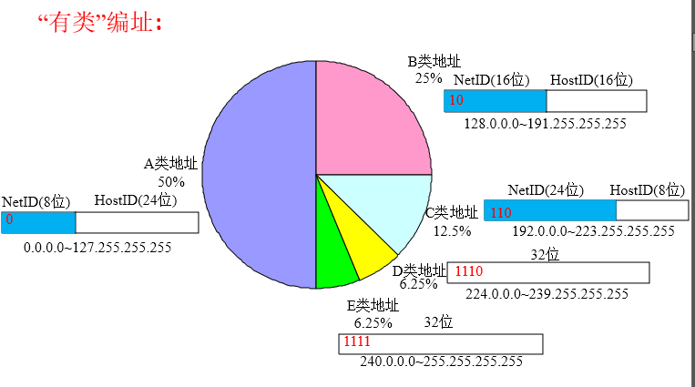

## 网络层

a:网络层的功能

b:路由算法（距离向量路由算法、链路状态路由算法、层次路由）

c:IPv4分组、IPv4地址、NAT、子网划分、子网掩码、CIDR、路由聚合

d:ARP协议、DHCP协议与ICMP协议

e:IPv6的主要特点、IPv6地址

f:路由协议（RIP、OSPF、BGP）

g:路由器的组成与功能、路由表与路由转发

### 网络层的功能

异构网络互联、路由与转发、拥塞控制

### 路由算法（距离向量路由算法、链路状态路由算法、层次路由）

静态路由：由网络管理员手动配置路由信息

动态路由：通过路由器间彼此交换的信息来构造路由表，分为距离-向量和链路状态算法

层次路由：将互联网分成许多较小的自治系统，系统有权决定自己内部采用什么路由协议

- 内部网关协议：自治系统内部使用的网关协议，如RIP、OSPF
- 外部网关协议：自治系统之间使用的网关协议，如BGP4

#### 距离-向量路由算法

D-V路由算法中，所有结点定期地将它们的**整个路由表传送给自己的邻居**。路由选择表包含

 (1)每条路径的目的地(另一结点) (2)路径的代价(距离) 

最常见的距离-向量路由算法是RIP算法，它采用"跳数"作为距离的度量

算法流程：

1. 路由器被通告一条新的路由，该路由在本结点的路由表中不存在，此时本地系统加入这条新的路由
2. 发来的路由信息中有一条到达某个目的地的路由，该路由比当前使用的路由有更小的代价。在此情况下使用新路由替代原有的那个路由

D-V算法更新报文的大小与通信子网的结点个数成正比，所以该算法更适合小网络。

#### 链路状态路由算法

链路状态算法要求每个参与的结点都具有完全的网络拓扑信息，它们执行以下两项任务：

1. 主动测试所有邻居的状态
2. 定期地将**链路状态（只包含自己邻居）传播给所有其他结点**

每当链路状态报文到达时，路由结点就对更新的网络图利用Dijsktra算法重新计算路由，从单一的源点（自己）出发计算所有目的结点的最短路径。

### IPv4分组、IPv4地址、NAT、子网划分、子网掩码、CIDR、路由聚合

|            |                                                              |
| ---------- | ------------------------------------------------------------ |
| 首部长度   | 占4位，**以4B(32位)为单位**，取值从5-15，表示首部长从20B-60B(最大) |
| 总长度     | 占2B(16位)，以字节为单位，最大为65535。在以太网中通常为1460B |
| 标识       | 占2B(16位)，为计数器(并不是序号)，通常用于IP分片再组装       |
| 标志位     | 占3位，从左 `保留 | DF | MF`. `DF=0`才允许分片，`MF=1`表示后面还有分片 |
| 片偏移     | 占13位(16-3)，表示该片在原分组中的相对位置，**以8B为单位**（因为前面让出3位） |
| TTL        | 占1B(8位)，表示生存时间，每经过一个路由器该值-1，减为0则丢弃 |
| 协议       | 占1B，表示该IP数据报封装的上层数据采用的协议，UDP=17，TCP=6  |
| 头校验和   | 占1B，校验IP的首部，校验和为IP首部各16位反码相加(循环进位)后取反 |
| 源IP地址   | 4B，表示发送方的IP地址，除NAT外在整个传输过程中一般不更改    |
| 目的IP地址 | 4B，表示接收方的IP地址                                       |
|            |                                                              |

IPV4地址，由`{<网络号>,<主机号>}`两部分组成。网络号和主机号的划分有以下三种方式：

- 有类编址

  

  - 127.0.0.0保留为环路自检地址，该地址的数据报永远不会出现在任何网络上

  - 32位全为0表示本网络的本主机

  - 32位全为1表示为整个TCP/IP的广播地址，实际等效为本网络广播地址

  - 128.0和192.0.0这两个网络号是不可指派的

  - **主机号全为0表示本网络本身，主机号全为1表示本网络的广播地址**(无论如何都不能被指派)

  - 每个网络中最大的主机数 = 2^n - 2，n为该表示该子网内主机的IP地址位数

    | 网络类别 | 最大可用网络数 | 第一个可用的网络号 | 最后一个可用的网络号 |
    | -------- | -------------- | ------------------ | -------------------- |
    | A        | 2^7-2          | 1                  | 126                  |
    | B        | 2^14-1         | 128.1              | 191.255              |
    | C        | 2^21-1         | 192.0.1            | 223.255.255          |

  - 私有IP地址网段，只用于LAN，不用于WAN

    - 1个A类：**10**.0.0.0~**10**.255.255.255
    - 16个B类：**172.15**.0.0~**172.31**.255.255
    - 256个C类：**192.168.0**.0~**192.168.255**.255

- 子网划分(子网掩码)

  ​	从主机号中借用若干比特作为子网号，子网掩码为1的部分代表网络号+子网号，为0的部分代表主机号。路由表中存储的就是目的网络地址、子网掩码、下一条地址，在路由器进行路由选择时，通过IP地址 `and `子网掩码计算出对应的子网号(router table entry)，从而匹配路由表。

- 无分类域间路由选择(CIDR)

  在变长子网掩码的基础上提出的消除传统A,B,C类网络划分的方法，已经成为事实上的通用标准

  使用`{<网络前缀>,<主机号>}`代替子网络的概念，常用斜线记法`/`表示网络前缀所占比特位数

  将网络前缀都相同的连续IP地址组成"CIDR地址块"，称为**路由聚合**

  **最长前缀匹配**：使用CIDR时，查找路由表时选择具有最长网络前缀的路由

### ARP协议、DHCP协议与ICMP协议

- ARP：对于特定的IP地址，查询其对应的物理地址，工作在网络层
- DHCP：给网络中的主机动态分配IP地址，基于UDP，是应用层协议
- ICMP：用来给主机或路由器报告差错和异常的情况，为网络层协议

### IPv6的主要特点、IPv6地址

- 首部40B，地址长度16B，主要用于解决IPv4的地址耗尽问题

- IPv6地址写法，16进制表示，每四个(16位)用冒号分隔。

- 无校验和，无掩码，无分片机制

- 可单播、广播、任意播

- 可缩写每个分割中前面的0，用双冒号缩写0域(整个IPv6地址字段只能用一次)

### 路由协议（RIP、OSPF、BGP）

| 协议     | RIP         | OSPF           | BGP                                    |
| -------- | ----------- | -------------- | -------------------------------------- |
| 类型     | 内部        | 内部           | 外部                                   |
| 工作层次 | 应用层(UDP) | 网络层         | 应用层(TCP)                            |
| 路由算法 | 距离-向量   | 链路状态       | 路径-向量                              |
| 传递协议 | UDP         | IP             | TCP                                    |
| 路径选择 | 跳数最少    | 代价最低       | 较好，非最佳                           |
| 交换结点 | 邻居        | 整个AS         | 邻居                                   |
| 交换内容 | 路由表      | 邻居的链路状态 | 首次，整个路由表；非首次：有变化的部分 |

### 路由器的组成与功能、路由表与路由转发

特点：可以用来连接异构网络，完成路由转发，能隔离冲突与和广播域，依照IP地址转发

组成：

- 控制部分：路由选择处理机，根据路由协议构造与维护路由表
- 分组转发部分：交换结构、一组输入端口和一组输出端口

路由转发：

- 直接交付：源主机和目的主机在同一个网络上，直接转发，无需通过路由器
- 间接交付：源主机和目的主机不在同一个网络上
